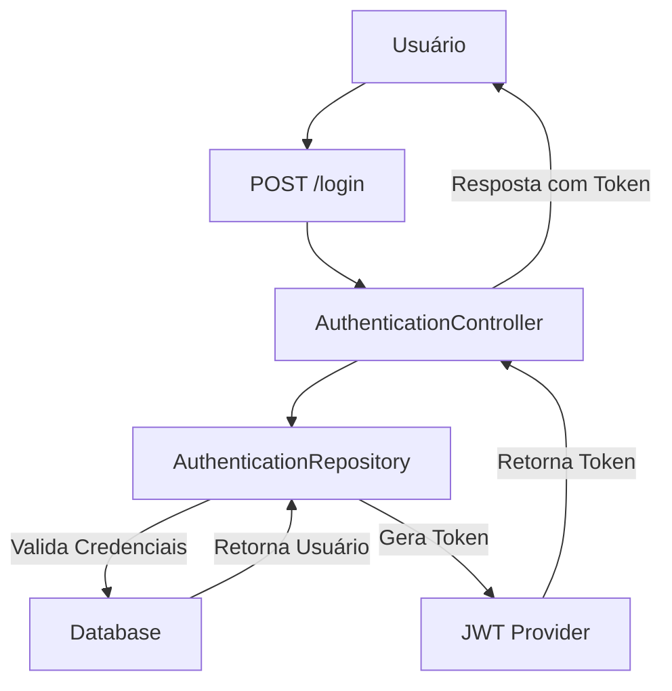
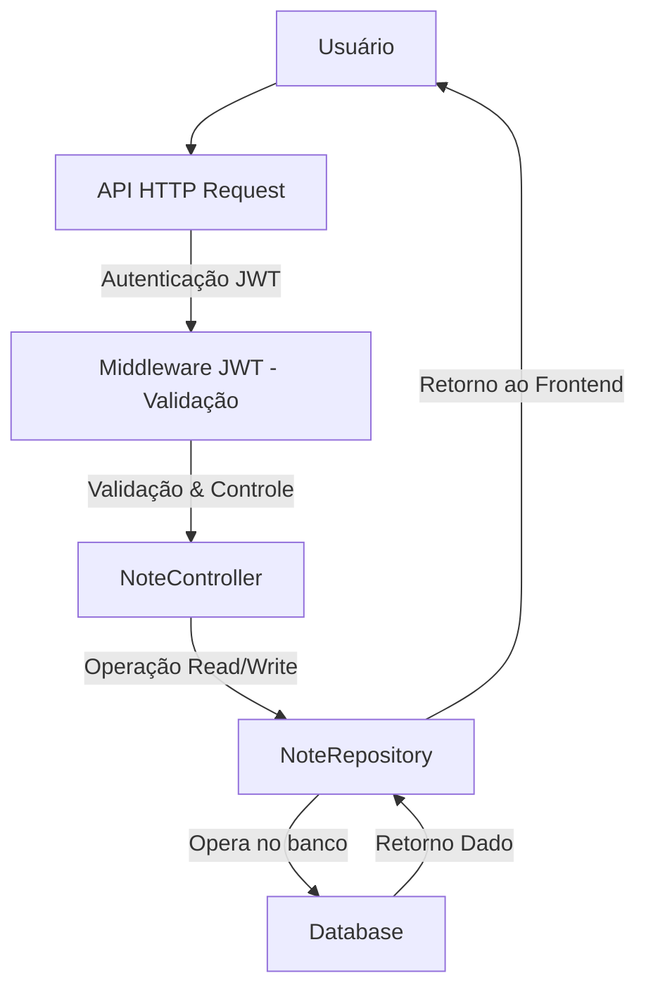

## Especificação Funcional do Sistema "API Notas do Deep"

### Visão Geral do Sistema
O sistema "API Notas do Deep" é uma API baseada no framework Laravel que visa permitir que usuários gerenciem suas notas através de operações CRUD (Create, Read, Update e Delete). A API utiliza JWT para autenticação, enquanto as notas e os usuários são armazenados em um banco de dados relacional gerenciado pelo Laravel. O sistema também implementa validação de entrada, tratamento de exceções e middleware para controle de acesso.

---

### Funcionalidades
#### 1. **Autenticação de Usuário**
   - Registro de novos usuários.
   - Login de usuários com geração de tokens JWT.
   - Logout de usuários.
   - Renovação de token JWT.
   - Validação de token JWT.

#### 2. **Gerenciamento de Notas**
   - Listar todas as notas de um usuário (`GET /note`).
   - Criar uma nova nota (`POST /note`).
   - Visualizar detalhes de uma nota específica (`GET /note/{id}`).
   - Atualizar os atributos de uma nota (`PUT /note/{id}` ou `PATCH /note/{id}`).
   - Excluir uma nota específica (`DELETE /note/{id}`).

---

### Requisitos Não Funcionais
   - **Segurança**: Uso de tokens JWT para autenticação e controle de acesso.
   - **Performance**: Implementação de `throttle:api` para limitar o número de requisições por minuto.
   - **Validação**: Utilização de regras de validação para garantir entradas confiáveis.
   - **Mensagens de Feedback**: Mensagens de erro e sucesso são enviadas em formato JSON.
   - **Escalabilidade**: Configuração para múltiplas conexões de banco de dados, suportando MySQL, SQLite, PostgreSQL, etc.

---

### Fluxos de Uso

#### **Usuário**
1. Registro de novo usuário:
   - **Endpoint**: `POST /registration`
   - Validação: Verifica se o email já existe no sistema.
   - Retorno: HTTP 201 (sucesso) ou 409 (conflito de email).

2. Autenticação:
   - **Endpoint**: `POST /login`
   - Validação: Email e senha.
   - Geração de token JWT para o usuário autenticado.
   - Retorno: Token JWT e dados do usuário (HTTP 200 ou 403 em caso de falha).

3. Logout:
   - **Endpoint**: `POST /logout`
   - Invalida o token do usuário atual.
   - Retorno: Mensagem de sucesso (HTTP 200).

#### **Nota**
1. Listar notas de um usuário:
   - **Endpoint**: `GET /note`
   - Validação: Confirmação do `user_id`.
   - Retorno: Lista de notas do usuário autenticado (HTTP 200 ou 400).

2. Criar nota:
   - **Endpoint**: `POST /note`
   - Validação: Campos obrigatórios (`user_id`, `type`, `title`, `description`).
   - Retorno: Dados da nota criada (HTTP 201 ou 400 em caso de erro).

3. Atualizar nota:
   - **Endpoint**: `PUT /note/{id}`
   - Validação: Atualização total ou parcial dos campos com validação.
   - Retorno: Dados da nota atualizada (HTTP 200 ou 400).

4. Visualizar uma nota:
   - **Endpoint**: `GET /note/{id}`
   - Retorno: Detalhes da nota (HTTP 200 ou 400 se id não existir).

5. Excluir nota:
   - **Endpoint**: `DELETE /note/{id}`
   - Retorno: Confirmação de exclusão (HTTP 200 ou 400 se id não existir).

---

### Componentes do Sistema e Arquitetura:
#### Arquivos e classes:
   - `app/Http/Controllers/AuthenticationController.php`:
      - Classe para gerenciar autenticação.
   - `app/Http/Controllers/NoteController.php`:
      - Classe de controle das operações relacionadas às notas.
   - `app/Models/User.php` e `app/Models/Note.php`:
      - Representação ORM das tabelas no banco de dados para usuários e notas.
   - `app/Repository`:
      - Classes responsáveis pela lógica de negócio de autenticação e gerenciamento de notas.
   - `config/jwt.php`:
      - Configuração de autenticação JWT.
   - `routes/api.php`:
      - Cadastro de rotas da API.
   - `database/migrations`:
      - Scripts para criação de tabelas no banco.

#### Diagrama de Arquitetura
```mermaid
graph TB
    A[Frontend ou Software Cliente]
    B[API Middleware]
    C[NoteController]
    D[AuthenticationController]
    E[Middleware JWT]
    F[User & Note - Models]
    G[Database Repository]
    H[Relational Database]
    
    A -->|Requisição HTTP (token JWT)| B
    B -->|Gerenciamento de Notas| C
    B -->|Autenticação| D
    C -->|Validação & Processamento| F
    D -->|Validação & Processamento| F
    F -->|Manipulação de Dados| G
    G -->|Operação| H
```

---

### Diagrama de Fluxo de Controle de Autenticação


---

### Diagrama de Fluxo de Controle CRUD de Notas


---

### Conclusão
O sistema "API Notas do Deep" implementa um conjunto robusto de funcionalidades para autenticação e gerência de notas. Ele segue boas práticas do Laravel, como uso de middleware, modelo MVC e autenticação JWT. A segurança e escalabilidade são priorizadas. Para a implementação final, é recomendado realizar testes complementares (`Feature` e `Unit`), conforme verificado no diretório `tests`.