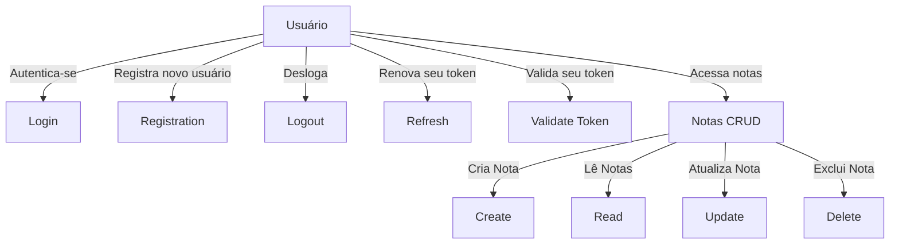

## Especificação Funcional do Projeto `API_notas_do_deep`

O **`API_notas_do_deep`** é uma aplicação baseada no framework Laravel que proporciona um sistema de autenticação e gerenciamento de notas (tarefas) para usuários. O sistema utiliza autenticação JWT para proteger as rotas da API e possui recursos RESTful para realizar operações CRUD (Criar, Ler, Atualizar e Excluir) sobre as notas.

---

### **Características principais do sistema**

1. **Autenticação de usuários** baseada em JWT.
   - **Criação de usuários** através do `registration`.
   - **Login** utilizando e-mail e senha.
   - **Logout** para invalidação do token.
   - **Renovação dos tokens** através do recurso `refresh`.
   - **Validação de tokens** para verificar se o token é válido.

2. **Gerenciamento de notas (CRUD)**:
   - **Criação de notas** associadas a usuários.
   - **Leitura de uma lista de notas** de um usuário.
   - **Leitura de uma nota específica** por ID.
   - **Atualização de notas** (com recurso de PATCH para alterações parciais).
   - **Exclusão de notas**.

3. **Camadas de Repositórios** para abstrair lógica de negócios associada a usuários e notas.

4. **Middleware e configuração centralizada**:
   - Middleware como `jwt.auth` protege as rotas de API relacionadas a notas.
   - Configurações para segurança e performance no uso de middleware, cache, CORS, etc.

---

### **Rotas da Aplicação**

#### **API Routes**
As rotas da API são definidas no arquivo `routes/api.php`. Elas incluem:

- **Autenticação**:
  - `POST /login` - Realiza login e retorna o token JWT.
  - `POST /registration` - Cria um novo usuário.
  - `POST /logout` - Faz logout do usuário autenticado e invalida o token.
  - `POST /refresh` - Renova o token.
  - `GET /validateToken` - Verifica se o token é válido.

- **Notas** (protegidas por `jwt.auth`):
  - `GET /note` - Retorna todas as notas de um usuário.
  - `POST /note` - Cria uma nova nota para um usuário.
  - `GET /note/{id}` - Retorna uma nota específica pelo ID.
  - `PUT/PATCH /note/{id}` - Atualiza uma nota pelo ID.
  - `DELETE /note/{id}` - Remove uma nota pelo ID.

---

### **Estrutura de Banco de Dados**

#### Tabelas e Configurações

1. **Tabela `users`**:
   - ID (auto incremento).
   - Campos: `name`, `email`, `password`.
   - Campo de lembrete: `remember_token`.

2. **Tabela `notes`**:
   - ID (auto incremento).
   - Campos: `description`, `user_id`, `title`, `type`.
   - Relacionamento: `user_id` como chave estrangeira que referencia `id` da tabela `users`.

---

### **Fluxo de Autenticação**

1. Usuário realiza o **login**.
   - Se as credenciais forem válidas, retorna um token JWT associando ao usuário.
   - Caso contrário, retorna erro `403 (Email ou senha inválidos)`.

2. Usuário utiliza o token para acessar as rotas protegidas como: **manipulação de notas** ou `logout`.

3. Token pode ser **renovado** usando a rota `POST /refresh`.

---

### **Fluxo de Gestão de Notas**

1. **Listagem**: utilizando o `GET /note`, é possível recuperar todas as notas relacionadas ao usuário autenticado.

2. **Criação**: utilizando o `POST /note`, cria uma nota. Validações:
   - `user_id`: campo obrigatório.
   - `type`: deve ser "text".
   - `title`: mínimo de 1 caractere.
   - `description`: obrigatório.

3. **Atualização**: utiliza o `PUT` ou `PATCH` para atualizar uma nota. Permite alterações de todos ou alguns dados.

4. **Exclusão**: utiliza o `DELETE` para remover notas específicas com base no identificador (ID).

---

### **Dependências e Configurações**

- Autenticação JWT configurada no arquivo `config/jwt.php`.
- Middleware:
  - `EncryptCookies` e `VerifyCsrfToken` implementam funções de segurança.
- Tratamento de exceções no arquivo de **Handler**.
- Serviço centralizado em Providers:
  - `AuthServiceProvider` para autenticação.
  - `RouteServiceProvider` define grupos e namespaces das rotas.

---

### **Arquitetura**

1. **Controllers**:
   - `AuthenticationController`: Gerencia todas as operações de autenticação.
   - `NoteController`: Gerencia operações CRUD das notas.
   - `Controller`: Classe base para os outros controladores.

2. **Models**:
   - `User`: Representa usuários no sistema e utiliza relacionamento com `Note`.
   - `Note`: Model das notas, com validação de regras e feedback de mensagens.

3. **Repositories**:
   - `AuthenticationRepository`: Abstração para lógica de autenticação e renovação de tokens.
   - `NoteRepository`: Abstração de lógica de negócios relacionada a notas.

4. **Camadas de Configuração**: Arquivos como `config/app.php`, `config/auth.php` etc., centralizam definições relacionadas à aplicação.

---

### **Diagramas**

#### **Diagrama de Casos de Uso**



---

#### **Diagrama de Classes Simplificado**

```mermaid
classDiagram

class User {
    id : integer
    name : string
    email : string
    password : string
    remember_token : string

    + tasks() : Relation
}

class Note {
    id : integer
    description : text
    user_id : integer
    title : string
    type : string

    + user() : Relation
    + rules() : array
    + feedback() : array
}

class AuthenticationController {
    - user : User
    + login(request)
    + registration(request)
    + logout()
    + refresh()
    + validateToken()
}

class NoteController {
    - note : Note
    + index(request)
    + store(request)
    + show(id)
    + update(request, id)
    + destroy(id)
}

User --> Note : "1:N Relation"
AuthenticationController --> User : "Interage com"
NoteController --> Note : "Interage com"
```

---

### **Conclusão**

O projeto é uma API RESTful segura e modular, com cada camada isolada para facilitar a manutenção e escalabilidade. Os fluxos de autenticação e gestão de notas estão bem definidos conforme as melhores práticas do Laravel. O sistema é adequado para aplicações baseadas em gerenciamento de usuários e notas.